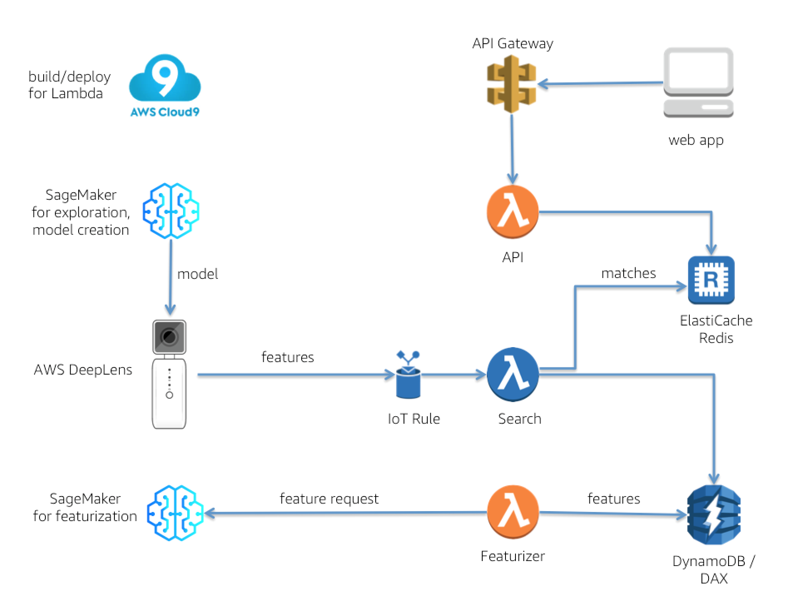

# Visual Search for AWS DeepLens

This project is a visual search engine.  After an AWS DeepLens device is shown an item, the device’s deep learning model output is used to populate a list of the top visually similar items.  Visual search is the central component of an interface where instead of asking for something by voice or text, you *show* what you are looking for.  

In brief, when shown an item, the DeepLens device generates a “feature vector”, and a Search Lambda function then compares the incoming feature vector of that item to a data store of reference item feature vectors.  The Search Lambda function returns the top visually similar reference item matches, which are then consumed by a web app via an API Lambda function fronted by API Gateway.  



## References 

The idea of using a pretrained CNN to extract features from images is discussed in the paper by **Babenko** et al (2014), *“Neural Codes for Image Retrieval”*.  To do feature extraction from images, the CNN layer before the last fully connected layer is used.  The output of this layer can be considered as a “feature vector” or “neural code” for an image that summarizes the image’s features.  For a typical CNN for images, namely ResNet, the feature vector consists of a vector of 2,048 floating point numbers.  

Given an image of a query item and a data store of feature vectors of reference items to be compared against the query, the cosine similarity metric can be used to find the most similar items to the query – the higher the cosine, the more similar.  For normalized feature vectors, the cosine is simply the dot product of the query item feature vector and the feature vector of the item to be compared.  The cosine similarity metric was chosen as the relevant metric after a review of relevant papers, such as **Machado** (2017), *“Image visual similarity with deep learning: application to a fashion e-commerce company.”*  Machado found that cosine similarity overall produced the best results after evaluating the performance of several distance metrics, including Manhattan, Euclidean, Minkowski, correlation, and Chebyshev as well as cosine similarity.

## How to Access the Model

The model for this project was created with Apache MXNet.  In regard to the location of the model, both the .json model definition and the model parameter file are hosted on Amazon S3.  The S3 bucket location has public read access, and is located at:

```
s3://deeplens-sagemaker-brent/VisualSearch
```

## How to Deploy

In order to deploy this project, you'll need to spin up multiple pieces of infrastructure.  The following instructions cover setup of the minimum number of pieces needed to view results.

1. **DeepLens setup**:  You'll need to create a DeepLens project with the model and a Lambda function for the DeepLens.
     - Model:  Place the model in a S3 bucket with a name of the form ```deeplens-sagemaker-<your_name>```.  Click the **Models** link in the left pane of the DeepLens console, then click **Import Model** and select **Externally trained model.**  Enter the S3 path and model name.
     - Lambda function:  From the DeepLens directory of this repository, copy the Lambda function code.  Create a new Lambda function with the GreenGrass template and paste the copied code into the code editor.  
     
2.  **Data Store setup**:  This project makes use of two separate data stores.
      - ElastiCache Redis:  using the ElastiCache console, create a one-node Redis cluster.  Make a note of the Primary Endpoint URL after creation.  
      - DynamoDB:  using the DynamoDB console, create a table named ```VisualSearchFeatures```.  Set the table's Partition key to be a String named **id**.  
     
3.  **API and Search Lambda function setup**:  To create and deploy these Lambda functions, it is recommended to use the AWS Cloud9 IDE for ease of use.
      - API Lambda function:  From the API directory of this repository, copy the Lambda function code.  Create a new Lambda function with a blank template and paste the copied code into the code editor. In the code, change the Redis endpoint URL to the Primary Endpoint URL of your ElastiCache Redis.  
      - Search Lambda function:  From the Search directory of this repository, copy the Lambda function code.  Create a new Lambda function with a blank template and paste the copied code into the code editor. In the code, change the Redis endpoint URL to the Primary Endpoint URL of your ElastiCache Redis.  Add an IoT trigger to the Lambda function configuration, with an IoT Rule of the form:
      ```
      SELECT * FROM '<your_DeepLens_device_MQTT_topic>'
      ```
      
4.  **API Gateway setup**:  using the API Gateway console, create an API.  The API only needs one method, a POST method with a resource of the form ```/matches```.  Be sure to enable CORS.  After the API is published, note the API's URL.

5.  **Front end / web app setup**:  Either download or clone this repository, then in the code replace the API URL with the URL of the API you created in the previous step.  Open the web app code in a text editor that has a captive Node.js server, such as the Brackets editor.  Highlight the index.html file, then launch the server, which will open a browser window.  In the web app UI, click through the **Visual Search** link, and you should see matches populating the UI after a few seconds.


